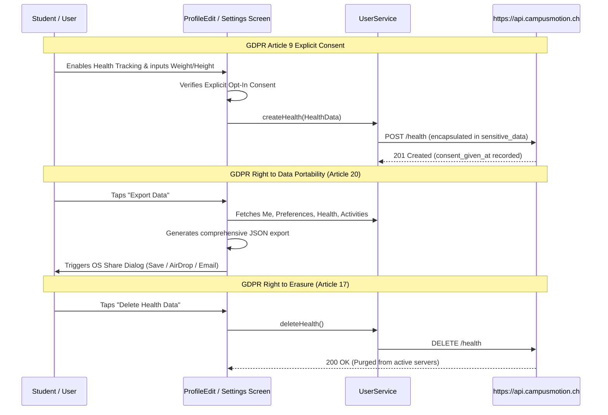

# Campus Motion - Architecture Documentation

This document describes the high-level architecture, design decisions, and data flows of the **Campus Motion** Flutter application (`mobile-app-v2`).

---

## 1. Project Background & Tech Tree Decisions

### 1.1 The Genesis (v1 - React Native & Expo)
In late 2025, Campus Motion began development as an Expo/React Native application (`mobile-app`). While rapid for early prototypes, several challenges emerged:
- **Dependency vulnerabilities & fragmentation**: Regular upstream breakages with Expo SDK updates.
- **Platform inconsistency**: Divergent styling between Android and iOS without extensive platform-specific tweaks.
- **Firebase Coupling**: Storing student activity and personal health data in Firebase created vendor lock-in and made European General Data Protection Regulation (GDPR) compliance difficult.

### 1.2 The Strategic Pivot to Flutter (v2)
In early 2026, the team made a strategic pivot to **Flutter 3** with **Dart 3**:
- **Unified Engine**: Single rendering engine compiling to native ARM machine code on Android and iOS, with first-class Web and desktop support.
- **Strong Static Typing**: Dart's sound null-safety eliminates entire classes of runtime exceptions.
- **Deterministic UI Hierarchy**: Clear widget tree composability.

### 1.3 Transition from Firebase to Custom GDPR-Compliant Backend
To guarantee privacy for EPFL/UNIL students:
- Firebase was deprecated and removed. All Firebase configuration files (`google-services.json`, `firebaseConfig.ts`, etc.) were scrubbed from tracking.
- A custom, GDPR-compliant REST API was established at:
  ```
  https://api.campusmotion.ch
  ```
- All networking routes through a centralized singleton gateway (`ApiService`) using standard JSON serialization and Bearer JWT authorization.

---

## 2. Architectural Layers

Campus Motion adheres to a **Clean Layered Architecture** with strict directional dependencies:

```
[UI Layer (Screens & Widgets)]
            ↓
[Domain Services Layer]
            ↓
[Network Gateway (ApiService)]
            ↓
[Remote Backend API (https://api.campusmotion.ch)]
```

### 2.1 Presentation Layer (`lib/screens/` & `lib/widgets/`)
- **Screen Shell & Responsive Containment (`MasterContainer`)**:
  - Located in `lib/widgets/master_container.dart`.
  - Every application screen **must** be wrapped in `MasterContainer`.
  - Implements a strict `maxWidth: 450` constraint. On wide screens (Web, tablet, desktop), content is centered within a mobile-phone aspect box rather than stretching uncontrollably.
  - Automatically manages `SafeArea`, `SingleChildScrollView`, and pull-to-refresh (`onRefresh`).
- **Navigation Shell (`CampusMotionBottomBar`)**:
  - Located in `lib/widgets/bottom_bar.dart`.
  - Anchors the 4 main application tabs:
    - Tab 0: Home / Dashboard (`AppRoutes.dashboard`)
    - Tab 1: Sport / Trail (`AppRoutes.trail`)
    - Tab 2: Social (`AppRoutes.social`)
    - Tab 3: Profile (`AppRoutes.profile`)
- **Centralized Routing (`AppRoutes`)**:
  - Located in `lib/config/routes.dart`.
  - Defines declarative string route constants and resolves them in `generateRoute(RouteSettings)`.
- **Reusable Component Library (`lib/widgets/`)**:
  - To prevent UI code duplication and ensure design system fidelity across screens and Figma imports, visual components are extracted into isolated primitives:
    - `AppCard`: Standard elevation, 20px corner radius, padding, and tap handler.
    - `AppButton`: Primary, secondary, outline, and danger variants with built-in loading spinner support.
    - `StatItem`: Standardized metric counter with value, unit, and label.
    - `ActivityCard`: Standardized activity tile with category iconography, duration, and privacy badge.
    - `ThemedText`: Typography wrapper bound to the application text theme.
    - `TopAppBar`: Consistent logo and branding header.
- **Design Tokens (`lib/constants/colors.dart`)**:
  - `AppColors` centralizes the color system:
    - Primary Terracotta: `0xFFDE7356` (`primary`, `primaryLight`, `primaryDark`)
    - Surfaces: `background`, `cardBackground`, `surfaceLight`, `divider`
    - Typography: `textPrimary`, `textSecondary`, `textMuted`
    - Status: `success`, `warning`, `error`, `info`
    - Activity categories: `activityRun`, `activityWalk`, `activityCycle`, `activityHike`, `activitySwim`
    - Shadow: `AppColors.shadow` (8% alpha black)


### 2.2 Domain Services Layer (`lib/services/`)
- All services are implemented as thread-safe Singletons:
  - `AuthService`: User registration, login, logout, password modification, current user session state.
  - `UserService`: User profile (`/users/me`), preferences (`/users/me/preferences`), health records (`/health`), photo uploads, social followers/following.
  - `ActivityService`: Activity logging, history retrieval, workout summaries.
  - `EventService`: Campus athletic events, participants joining/leaving.
  - `NewsService`: Campus athletic announcements and bulletins.
- **Rule**: Presentation code never speaks directly to HTTP; it calls Domain Services.

### 2.3 Network Gateway (`lib/services/api_service.dart`)
- Centralizes HTTP requests (`get`, `post`, `put`, `delete`).
- Injects standard headers (`Content-Type: application/json`, `Authorization: Bearer <token>`).
- Provides CORS proxy bypass for local Web development (`corsproxy.io`).

### 2.4 Model Layer (`lib/models/`)
- Strictly typed, immutable Dart data classes:
  - `User`: Profile information, username, email, role.
  - `UserPreferences`: Preferred sports, workout intensity, distance threshold, group openness.
  - `HealthData`: Sensitive health metrics (weight, height, age, consent, retention).
  - `Activity`: Athletic sessions (distance, duration, type, public visibility).
  - `Event`: Scheduled community events and attendee counts.
  - `NewsItem`: Editorial news feed items.
- Every model provides `factory fromJson(Map<String, dynamic>)` and `Map<String, dynamic> toJson()`.

---

## 3. GDPR & Privacy Architecture

Campus Motion processes student health and biometric data. Under the European General Data Protection Regulation (GDPR), biometric and health data are classified as **Special Category Data (Article 9)**.



1. **Explicit Consent (Art. 9)**: No health data is stored or retrieved without explicit opt-in confirmation. Consent can be revoked at any time.
2. **Data Encapsulation**: Physical metrics (`weight_kg`, `height_cm`) are wrapped in `sensitive_data` JSON string with client key versioning (`client_key_version: 1`).
3. **Privacy by Default**: New activity entries default to `is_public: false`.
4. **Right to Erasure (Art. 17)**: One-tap deletion of health data and complete account erasure.
5. **Right to Data Portability (Art. 20)**: Full JSON export of all personal data via `_exportData()`.
6. **Storage Limitation (Art. 5)**: Health data carries a 2-year retention threshold (`retain_until`).

---

## 4. Testing Strategy

1. **Unit Tests**:
   - Verify serialization/deserialization of `lib/models/`.
   - Verify Domain Services with mock responses.
2. **Widget Tests**:
   - Verify UI component rendering.
   - Must pump widgets inside `MaterialApp` and verify `MasterContainer` containment.
3. **Execution**:
   ```bash
   flutter test
   ```
