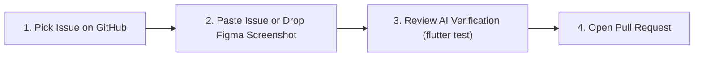

# Student Onboarding & AI Workflow Guide

Welcome to the **Campus Motion** engineering team!

If you are reading this, you might have little or no experience with Software Engineering, Flutter, Dart, or Git. **That is completely okay!** 

Just like in STEVE, our repository is set up with an **Authoritative AI Operating Contract** (`AGENTS.md`). You do **not** need to learn prompt engineering, write system prompts, or explain our tech stack to the AI.

The AI already knows our architecture, our GDPR invariants, our component library, and our code rules. **You just give it the GitHub issue or a Figma screenshot.**

---

## The Zero-Prompt 4-Step Workflow



### Step 1: Pick an Issue on GitHub
1. Go to the [Campus Motion GitHub Repository](https://github.com/Campus-Motion/mobile-app-v2/issues).
2. Find an issue assigned to you (or choose an open issue labeled `good first issue` or `help wanted`).
3. Note the issue number and title (e.g. `Issue #14: Add distance filter on events`).

---

### Step 2: Copy & Paste the Raw Issue (or Drop a Figma Screenshot)
Open your preferred AI tool (Cursor Composer, Claude Code, Antigravity, ChatGPT, or Copilot) and **simply paste the raw GitHub issue or drop your Figma screen mockup**:

```text
Issue #14: Add distance filter on upcoming events
[Optional: Attach screenshot of the Figma design]
```

**That is all!** You do not need to add system instructions or explain Flutter. The AI will automatically:
1. Read `AGENTS.md`.
2. **Deconstruct the design into reusable components**: It checks `lib/widgets/` first to reuse existing cards ([`AppCard`](../mobile_app/lib/widgets/app_card.dart)), buttons ([`AppButton`](../mobile_app/lib/widgets/app_button.dart)), metrics ([`StatItem`](../mobile_app/lib/widgets/stat_item.dart)), and activity tiles ([`ActivityCard`](../mobile_app/lib/widgets/activity_card.dart)).
3. **Prevent Code Duplication**: If the Figma design introduces a new component, it extracts it into `lib/widgets/` instead of writing a massive 1000-line screen file.
4. Keep the UI inside `MasterContainer` with standard design tokens (`AppColors`).
5. Run `flutter analyze` and `flutter test` to verify its own code.
6. Provide you with the exact Git commands and PR description.

---

### Step 3: Review the AI's Verification
Before accepting the AI's work, check its final output:
- Did the AI run `flutter analyze` and report **0 errors**?
- Did the AI run `flutter test` and report **All tests passed**?

If anything failed, tell the AI:
```text
flutter analyze reported errors. Please fix them.
```

---

### Step 4: Open a Pull Request (PR)
The AI will give you ready-to-run Git commands at the end of its response. In your terminal:

1. Create a branch and commit the changes:
   ```bash
   git checkout -b feat/event-distance-filter
   git add .
   git commit -m "feat(events): add distance filter slider"
   git push origin feat/event-distance-filter
   ```
2. Go to GitHub and click **Compare & pull request**.
3. Copy-paste the **Pull Request Summary** generated by the AI into the PR description.
4. GitHub Actions CI will run our automated quality gates.

---

## 🎨 Working with Figma Screenshots: How the AI Prevents Duplication

When you give the AI a screenshot, our contract forces it to follow a strict **Component-First Pipeline**:

```
[Figma Screenshot] 
       ↓ 
Break down into Atomic Components:
  ├── Card container   ──> Reuses AppCard (lib/widgets/app_card.dart)
  ├── Action button    ──> Reuses AppButton (lib/widgets/app_button.dart)
  ├── Metric display   ──> Reuses StatItem (lib/widgets/stat_item.dart)
  ├── Activity item    ──> Reuses ActivityCard (lib/widgets/activity_card.dart)
  └── New UI Widget    ──> Extracts to lib/widgets/<new_widget>.dart
       ↓
Assemble Screen inside MasterContainer (lib/screens/)
```

### Why This Matters:
- **No duplicate code**: Multiple screens can reuse the exact same card, button, and metric widgets.
- **Visual consistency**: All screens automatically match the Campus Motion design system, colors, and shadows.
- **Easy maintenance**: If we change the card shadow or corner radius in the future, we change it in one place (`AppCard`) rather than across 20 screen files!

---

## 5 Red Flags: How to Spot an AI "Hallucination"

Because LLMs were trained on millions of generic Flutter projects, they sometimes try to use patterns that **do not belong** in Campus Motion. If you see the AI doing any of these, reject it:

| Red Flag | Why It's Wrong | What It Should Be |
|---|---|---|
| **AI creates a giant 800+ line screen with inline cards** | High code duplication and hard to test. | Visual components must be extracted into `lib/widgets/`. |
| **AI invents random hex colors `Color(0xFF...)`** | Breaks design system consistency. | All colors must use `AppColors` (`lib/constants/colors.dart`). |
| **AI installs Firebase packages** | We rejected Firebase for privacy reasons. | We use our custom REST backend at `https://api.campusmotion.ch`. |
| **AI creates a screen without `MasterContainer`** | The screen will stretch and break on web/tablets. | Every screen must be wrapped in `MasterContainer` (`lib/widgets/master_container.dart`). |
| **AI forgets `if (!mounted) return;`** | Causes app crashes across async gaps. | Always check `if (!mounted) return;` after an `await` before touching `BuildContext`. |

---

## Automated Assistant Commands

If you run into issues later in the PR lifecycle:
- **/fix-ci**: If the GitHub Actions CI goes red, tell the AI `/fix-ci`. It will download the failed logs, fix the source code locally, and verify tests pass.
- **/correct-pr**: When your teammates or coaches leave review comments on GitHub, tell the AI `/correct-pr`. It will read the comments and apply the requested refactors.

Welcome aboard, and happy coding!
