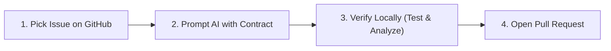

# Student Onboarding & AI Workflow Guide

Welcome to the **Campus Motion** engineering team!

If you are reading this, you might have little or no experience with Software Engineering, Flutter, Dart, or Git. **That is completely okay!** This guide is designed to empower you to build real, production-ready features safely using AI coding agents (such as Claude Code, Cursor, Antigravity, or ChatGPT).

---

## The Golden Rule

> **Never let an AI write code blindly.**
> Our repository has an **Authoritative AI Operating Contract** (`AGENTS.md`).
> Whenever you prompt an AI, you must ensure it follows our architecture, respects student health privacy (GDPR), and runs local checks before you push.

---

## The 4-Step Issue-to-PR Workflow



### Step 1: Pick an Issue on GitHub
1. Go to the [Campus Motion GitHub Repository](https://github.com/Campus-Motion/mobile-app-v2/issues).
2. Find an issue assigned to you (or choose an open issue labeled `good first issue` or `help wanted`).
3. Create a new Git branch on your machine:
   ```bash
   git checkout main
   git pull origin main
   git checkout -b feat/your-feature-name
   ```
   *(For example: `git checkout -b feat/event-filter-distance`)*

---

### Step 2: Prompt Your AI Coding Agent
Copy and paste the template from [`docs/AGENT_PROMPT_TEMPLATE.md`](AGENT_PROMPT_TEMPLATE.md) into your AI tool (Claude Code, Cursor, Antigravity, etc.), replacing `<PASTE_GITHUB_ISSUE_HERE>` with your issue description.

> [!TIP]
> **If you use Cursor or Claude Code**: The agent will automatically read `AGENTS.md` and `.cursorrules` located in the root of the project! You can simply say:
> *"Implement this issue according to AGENTS.md: [Paste issue text]"*

---

### Step 3: Verify the Changes Locally
Once the AI finishes making changes, run our two automated quality gates. Open your terminal in `mobile_app` and run:

1. **Check for Code Errors & Warnings**:
   ```bash
   flutter analyze
   ```
   *Expected outcome*: Zero errors! If there are errors, tell your AI:
   *"flutter analyze reported these errors: [paste errors]. Please fix them."*

2. **Run the Test Suite**:
   ```bash
   flutter test
   ```
   *Expected outcome*: All tests passed!

---

### Step 4: Open a Pull Request (PR)
1. Commit your changes:
   ```bash
   git add .
   git commit -m "feat(scope): brief description of what you built"
   ```
2. Push your branch to GitHub:
   ```bash
   git push origin feat/your-feature-name
   ```
3. Go to GitHub and click **Compare & pull request**.
4. Fill in the PR description using the summary provided by the AI.
5. Our automated GitHub Actions CI will automatically test your code.

---

## 5 Red Flags: How to Spot an AI "Hallucination"

Because LLMs were trained on millions of generic Flutter projects, they sometimes try to use patterns that **do not belong** in Campus Motion. Watch out for these 5 red flags:

| Red Flag | Why It's Wrong | What It Should Be |
|---|---|---|
| **AI installs Firebase packages** | We rejected Firebase for privacy reasons. | We use our custom REST backend at `https://api.campusmotion.ch`. |
| **AI creates a screen without `MasterContainer`** | The screen will look broken and stretch across wide web/desktop monitors. | Every screen must be wrapped in `MasterContainer` (`lib/widgets/master_container.dart`). |
| **AI makes direct `http.get` calls in a UI Screen** | Violates clean layering and makes testing impossible. | Calls must go through a Domain Service in `lib/services/`. |
| **AI saves health data without asking for consent** | Violates GDPR Article 9. | Must verify explicit opt-in consent before collecting weight, height, or date of birth. |
| **AI forgets `if (!mounted) return;`** | Causes app crashes when a user navigates away before a network call finishes. | Always check `if (!mounted) return;` after an `await` before touching `BuildContext`. |

---

## Helpful Commands Cheat-Sheet

All commands are run inside the `mobile_app` folder:

```bash
# 1. Download packages if something is missing
flutter pub get

# 2. Check code quality
flutter analyze

# 3. Run automated tests
flutter test

# 4. Run the app on your computer in Google Chrome
flutter run -d chrome

# 5. Run the app on a connected phone or simulator
flutter run
```

If you ever get stuck, reach out to your project manager or team coach on Discord or GitHub!
